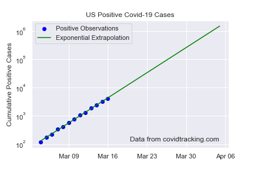

These notebooks contain simple mathematical models to conceptually understand the spread of the covid illness.

They are not intended to be accurate enough for decision making, but to help the public understand the basic trends and implications.

Here is a link to run these notebooks on your own computer through a browser.

